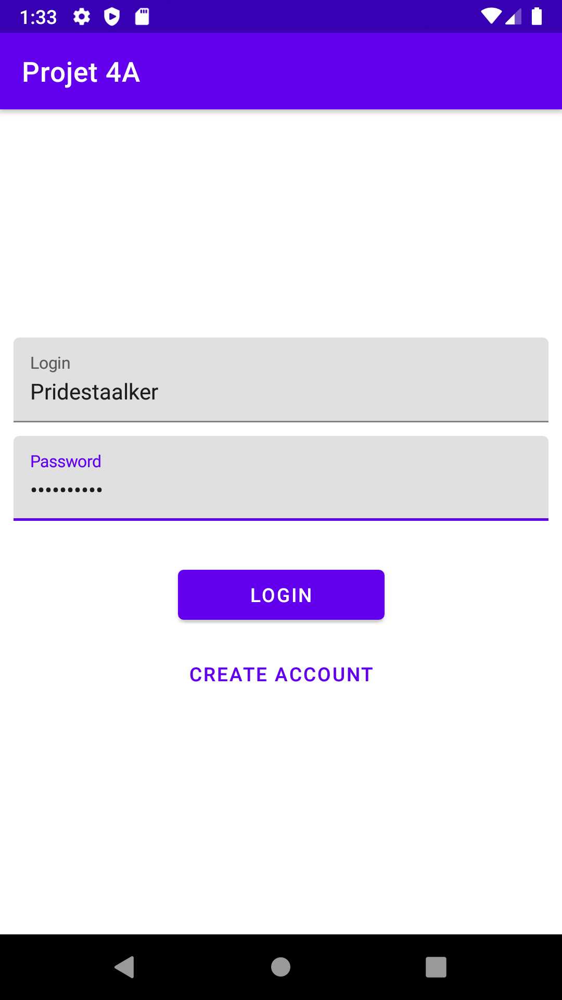
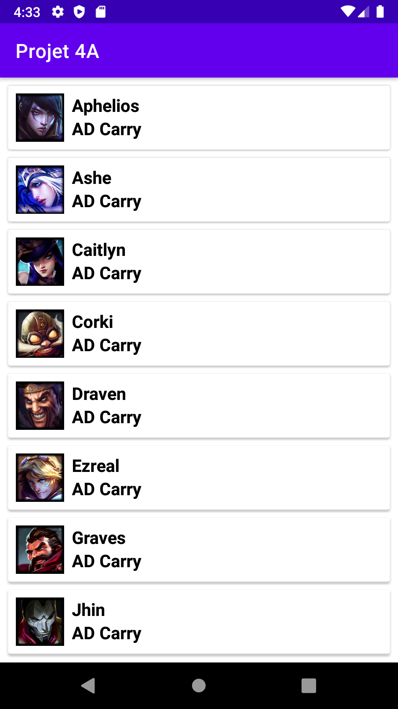

# DEX AD CARRY LOL 2020

Projet de 4A consistant à se logger via page Login et d'accéder à une liste via API Rest, en l'occurence ici une liste des AD Carry de League of Legends

## Les Prérequis

- Installation d'Android Studio à jour

## Fonctionnalités et Conception

- Utilisation du langage Kotlin

- Langage Kotlin
- Utilisation de Koin
- Affichage d'une liste avec RecyclerView
- Affichage des Personnages et de leur rôle
- Clean Architecture & MVVM
- Design correct
- Mise en place d’une BDD avec Room
- Design correct

## Screens

### Premier Ecran (LoginScreen)

- Affiche une Login Page

### Second Ecran (Liste RecyclerView)

- Affiche la liste des AD Carry

